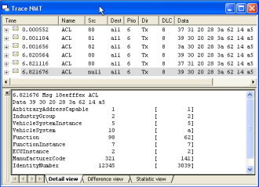
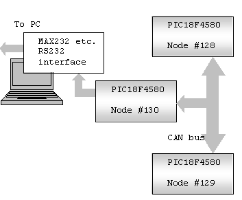

<!--
J1939 CAN bus spy    BODY {font-family: Verdana,courier;} .myText {COLOR: #339900} .quoted {COLOR: gray} .highlite {BACKGROUND-COLOR: #ffff33} A:hover { TEXT-DECORATION: underline; FONT-WEIGHT: bold } BODY { background : transparent url(images/gutter\_gray.png) repeat-y; } TD {font-size: small;font-family: Verdana,courier;} .myText {COLOR: #339900} .quoted {COLOR: gray} .highlite {BACKGROUND-COLOR: #ffff33} A:hover { TEXT-DECORATION: underline; FONT-WEIGHT: bold }

Last Updated 2006-May-05
-->

### J1939.c CAN Bus plus RS232

What is this page about?  
  
Our aim is to develop a CAN bus (J1939) - RS232 (later, USB) analyzer, and to learn about CAN and J1939 in the process, using the most crude (or free, or cheap) tools available...  
If something useful comes out of it, the better.  
  

[View my guestbook](guestbook/index.html)

* * *

  

Please let me know of any broken links, missing parts etc. you may find here.  
Next issues will become more sophisticated - I hope!.  
  

Don't want to miss the next chapter? just drop me an email to recursos.pt@gmail.com subject: J1939 CAN, and I will notify you.  
No other use will be made of your e-mail address.

  
  
I am afraid my english sucks! if you feel like editing this text, making it more palatable, please contact me!  

  

  
  
[Free Hit Counter](http://www.amazingcounters.com/)  

* * *

[Chapter 7](index_7.html) \+ [Chapter 8](index_8.html) (on line 2006-May-04)   
  
After too much time playing with the simulation software(s), and having become familiar with the basic NMT procedures of J1939, it downed on me that Microchip's provided [source code](http://ww1.microchip.com/downloads/en/AppNotes/J1939.zip)  for [J1939.c CAN library](http://ww1.microchip.com/downloads/en/AppNotes/00930a.pdf)  has a nasty bug.  
  
Not only that, but also Vector's CANoe CAPL code for their AddressClaiming\_CN.cfg sample, much touted by myself in [Chapter 5](index_5.html) suffers exactly the same bug!  
  

  
  
  

* * *

[Chapter 6](index_6.html) (on line 2006-April-27)   
  
This time we play with the second CAN/J1939 simulator, Michael Eisele's Xtm.  
In a very small foot-print Xtm implements much of the simulation features we have already played with.  
  

  

  
Again we have a look at the NMT Address Claim process, simulating 2 address conflits, each one with a different outcome.  

* * *

  
  
[Chapter 5](index_5.html) (on line 2006-March-29)  
  
Who needs a CAN/J1939 simulator? Well, if you are learning CAN/J1939 surely you can use it, among others, to test if the NMT behaviour (network management) you have coded and believe is OK, is indeed conforming to the SAE standard.  
CANoe simulator is a wonderful tool for that, and on top of its price can't be beaten (yes, the limited but functional demo is free).  
It does a lot more than what we need or can understand (!), but let us have a look at just a small parcel of it.  
  

(Notice: Address Claiming CAPL code has a nasty bug, please read [Chapter 8](index_8.html))  

  

  
 

* * *

[Chapter 4](index_4.html) (on line 2006-March-16)   
  
The firmware we have been using (J1939.c CAN library, Microchip's AN930) is just doing Address Claiming and sending a "toggle LED" command. Not terribly exciting!  
So we want to improve it, but that means going deeper into understanding the SAE J1939 protocol (automotive, commercial vehicles, etc.).  
We could use some help in that, and luckily there are at least 2 free "demos" available which we can use.  
  

") 

* * *

[Chapter 3](index_3.html) (on line 2006-March-06)   
  
A very modest modification to the CAN-Uart #130 device code, to place it in ListenOnly mode, and with all masks set to 00s, to allow any and all messages in - not just the ones addressed to the device.  
  
Yes, it works - now we can se all messages; not a lot of fun, because there are not that many messages to see... should we plug the thing into an OBD2 connector?  
Well, not yet there.  
  

* * *

#### [Chapter 2](index_2.html) (on line 2006-Feb-21)

Now we became more ambitious: we want to spy the CAN bus traffic and log it to our PC's screen so that we can leisurely study it (we like things that difficult:=).  
  
After much head scratching, we hit upon this: let us keep the 2 nodes #128 and #129 exchanging messages, and add a 3rd node, #130, listening to them, and reporting to the PC.  
  

  

  

So we moved the UARTIntC.c code to a third device, node #130, and now we are indeed dumping the CAN buffer registers to the PC, but with a heavy limitation: our "spy" only sees messages addressed to himself.  
OK, our next improvement is coming soon.  
  

* * *

#### [Chapter 1](index_1.html "skip this and go to Chapter 2!") (on line 2006-Feb-14)

Microchip's [source code](http://ww1.microchip.com/downloads/en/AppNotes/J1939.zip)  for [J1939.c CAN library](http://ww1.microchip.com/downloads/en/AppNotes/00930a.pdf)  (Kim Otten et al.), plus Application Maestro generated code UARTIntC.c, were used to implement a bare-bones system with a 2-node CAN bus.  
  

(Notice: Address Claiming code has a nasty bug, please read [Chapter 7](index_7.html))  

  
Node #129 upon receiving commands from #128 toggles a LED and also outputs strings "ON" and "OFF" thru the RSR23 to the PC.  
  

  

In this first effort we were not reading the CAN buffers, rather just making sure that our UART was working embedded in the same PIC with the CAN firmware.  
  

* * *

  
[©Rec](mailto:recursos.pt@gmail.com)  (recursos.pt@gmail.com)  
2006-05-05
